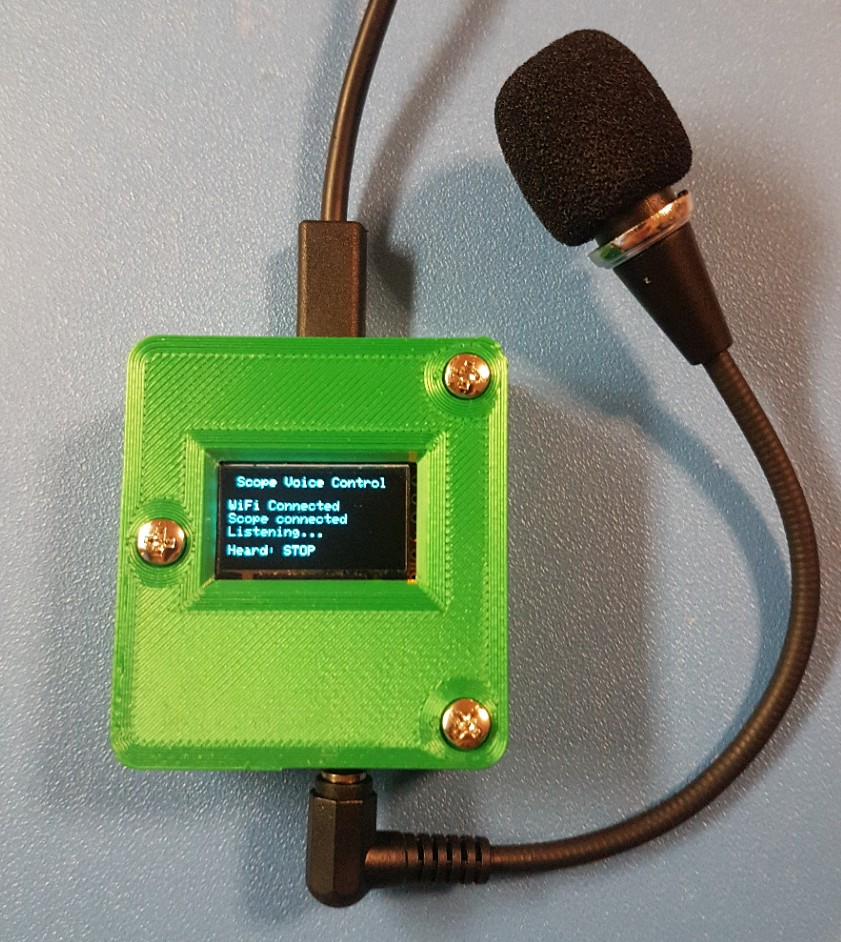

# Oscilloscope Voice Control using an ESP32 and Elechouse VR3

This is a fairly simple ESP32 Arduino application which listens for voice words from an Elechouse voice recognition module V3, and issues matching comands to the network-attached oscilloscope. "Stop", "Run", etc. It builds on top of this [ESP32 - Elechouse VR3 library.](https://github.com/frankvanhooft/ESP32-ElechouseVR3)

The Arduino code is in this repo, as well as STL and Fusion 360 files for a matching housing.

 Full project details are found here: [Oscilloscope Voice Control project](https://www.frankvh.com/oscilloscope-voice-control-using-esp32/) - it works quite well.
